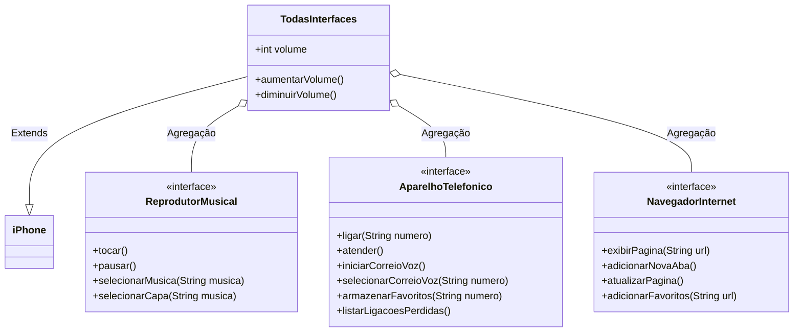

# POO - Desafio

## Descrição do desafio
### Modelagem e Diagramação de um Componente iPhone

Neste desafio, você será responsável por modelar e diagramar a representação UML do componente iPhone, abrangendo suas funcionalidades como Reprodutor Musical, Aparelho Telefônico e Navegador na Internet.

#### Contexto
Com base no vídeo de lançamento do iPhone de 2007 (link abaixo), você deve elaborar a diagramação das classes e interfaces utilizando uma ferramenta UML de sua preferência. Em seguida, implemente as classes e interfaces no formato de arquivos `.java`.

[Lançamento iPhone 2007](https://www.youtube.com/watch?v=9ou608QQRq8)

#### Funcionalidades a Modelar
1. **Reprodutor Musical**
   - Métodos: `tocar()`, `pausar()`, `selecionarMusica(String musica)`
2. **Aparelho Telefônico**
   - Métodos: `ligar(String numero)`, `atender()`, `iniciarCorreioVoz()`
3. **Navegador na Internet**
   - Métodos: `exibirPagina(String url)`, `adicionarNovaAba()`, `atualizarPagina()`

### Objetivo
1. Criar um diagrama UML que represente as funcionalidades descritas acima.
2. Implementar as classes e interfaces correspondentes em Java (Opcional).

## Resultados
Comparativo entre as funcionalidades propostas e todas as funcionalidades modeladas como solução para o desafio.
Obs: As funcionalidades em **negrito** foram modeladas e implementadas além das propostas no desafio.

1. **Reprodutor Musical**
   - Métodos: `tocar()`, `pausar()`, `selecionarMusica(String musica)`, **`selecionarCapa(String musica)`**
2. **Aparelho Telefônico**
   - Métodos: `ligar(String numero)`, `atender()`, `iniciarCorreioVoz()`, **`selecionarCorreioVoz(String numero)`**, **`armazenarNumeroFavorito(String numero)`**, **`listarLigacoesPerdidas()`**
3. **Navegador na Internet**
   - Métodos: `exibirPagina(String url)`, `adicionarNovaAba()`, `atualizarPagina()`, **`adicionarUrlFavoritos(String url)`**

### Diagrama de classes (UML)

### Implementação das classes Java
Todas as classes foram implementadas e os códigos estão disponíveis nas pastas desse repositório.

## Linguagem de Programação

## Ferramentas

 

